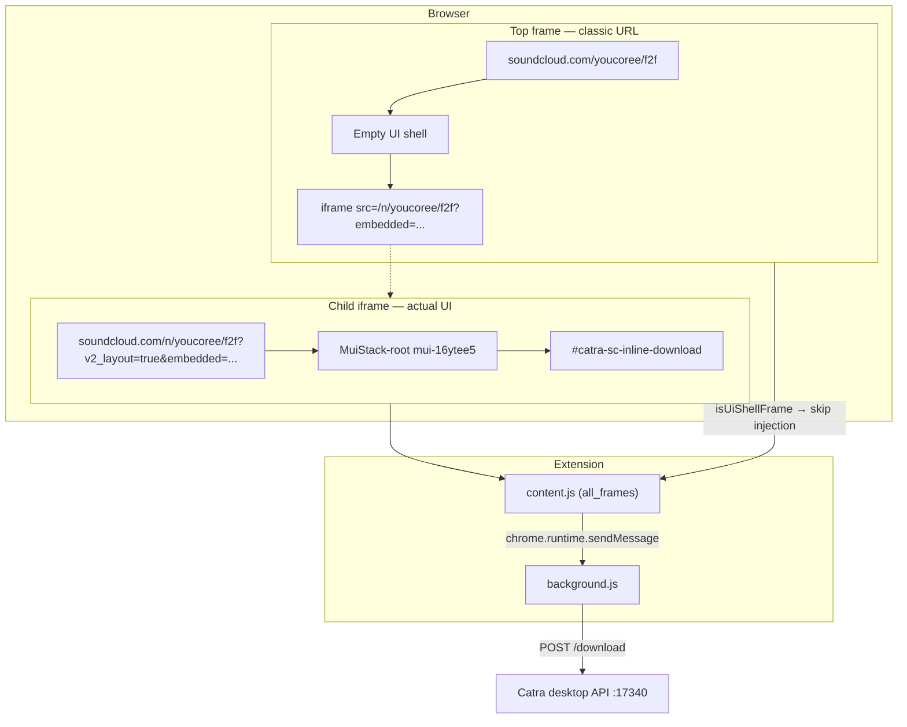

# Catra SoundCloud Chrome Extension — Architecture

## Overview

This extension injects download buttons into SoundCloud track pages. Clicking a button sends the track URL to the Catra desktop app (`http://127.0.0.1:17340/download`), which starts the download via yt-dlp.

**Load path:** unpacked extension from `apps/chrome/` (not the repository root).

**Current version:** 0.3.7

---

## Final Architecture



### Component responsibilities

| File | Role |
|------|------|
| `manifest.json` | MV3 config; `all_frames: true` on `soundcloud.com` |
| `src/utils.js` | `CatraSC.normalizeTrackUrl()` — strip query/hash, trailing slash |
| `src/content.js` | DOM discovery, button injection, SPA navigation, polling |
| `src/styles.css` | Button states (loading/success/error), icon sizing |
| `src/background.js` | Bridge to Catra local API (`/health`, `/download`) |

### Injection flow

1. **Bootstrap** — log startup, hook `history.pushState/replaceState`, start `MutationObserver`, poll every 500ms.
2. **Page classification** — `isTrackPage()` / `isPlaylistPage()` from pathname (strip `/n/` prefix).
3. **Frame selection** — top shell frame skips injection; child iframe with MUI UI injects.
4. **Container discovery** — find `mui-16ytee5` (primary) or legacy `sc-button-group` (fallback).
5. **Button insert** — before `More menu`; re-insert if React removes it.
6. **Download** — `getCurrentPageUrl()` normalizes to classic URL without `/n/` prefix.

---

## SoundCloud Page Structure (discovered)

SoundCloud uses a **dual-frame layout** on classic URLs:

| Layer | URL example | DOM |
|-------|-------------|-----|
| Top frame | `https://soundcloud.com/youcoree/f2f` | Wrapper only; **no** `mui-16ytee5` |
| Child iframe | `https://soundcloud.com/n/youcoree/f2f?crossfade=true&v2_layout=true&embedded=...` | MUI action bar with `mui-16ytee5` |

The address bar shows the classic path, but the visible UI (Share, More menu, etc.) lives inside the `/n/` iframe. DevTools on the top document shows `muiContainers: 0`; the child frame shows `mui-16ytee5`.

### Action bar selectors

| UI | Container | Insert before | Template button |
|----|-------------|---------------|-----------------|
| New (MUI) | `.mui-16ytee5` / `MuiStack-root` | `button[aria-label="More menu"]` | `button.MuiIconButton-root` |
| Legacy | `.listenEngagement__actions .sc-button-group` | `.sc-button-more` | adjacent `sc-button` |

Discovery also uses Shadow DOM traversal (`collectElementsDeep`) when elements are inside shadow roots.

---

## Investigation Record

### Symptom

Download button did not appear on `https://soundcloud.com/youcoree/f2f`. User confirmed `mui-16ytee5` exists in DevTools. No console errors initially; later no `[Catra SC]` logs at all.

### Missteps (lessons)

1. **Assumed old vs new UI by URL path** — Classic URL does not imply legacy DOM; new MUI can render inside an iframe while the URL stays `soundcloud.com/{user}/{track}`.
2. **Assumed `mui-16ytee5` hash had changed** — Class was valid; failure was scope (wrong frame / wrong subtree).
3. **Scoped search inside list-item children** — Sibling action bars are missed when `root` is a child element only.
4. **Stopped polling after 60s** — React re-renders could remove the button after polling stopped.
5. **No startup logs** — Hard to tell whether the content script loaded.

### Resolution path

| Version | Change |
|---------|--------|
| 0.3.4–0.3.5 | MUI container search, navigation hook fixes, persistent polling |
| 0.3.6 | `[Catra SC]` debug logs, Shadow DOM search, `all_frames: true`, `*.soundcloud.com` matches |
| 0.3.7 | **Shell frame detection** — skip top frame when embedded `/n/` iframe exists; inject only in child frame; normalize `/n/` URLs for download |

### Confirming logs (success)

```
[Catra SC] script evaluating https://soundcloud.com/youcoree/f2f          → frame: top
[Catra SC] script evaluating https://soundcloud.com/n/youcoree/f2f?...      → frame: child
[Catra SC] inline download button inserted { containerClass: 'MuiStack-root mui-16ytee5', insertBefore: 'More menu' }
[Catra SC] inline download button ready { frame: 'child', connected: true, visible: true }
```

Top frame: no action containers (`muiContainers: 0`). Child iframe: button inserted before More menu.

---

## Runtime Behavior

### Frame policy

```text
shouldHandleInlineButton()
  ├─ not track page / is playlist → skip
  ├─ isUiShellFrame() (top + no local MUI + embedded /n/ iframe) → skip
  └─ else → find container and inject
```

### Resilience

- **Polling** — `setInterval` 500ms, never stops on track pages.
- **MutationObserver** — watches for action bar nodes added and `#catra-sc-inline-download` removed.
- **History hooks** — `pushState` / `replaceState` / `popstate`; same-URL updates only `scheduleRefresh`, not full teardown.
- **Re-insert** — if button exists but container was replaced, move button to the new container.

### URL normalization

```text
iframe URL:  https://soundcloud.com/n/youcoree/f2f?embedded=...
download URL: https://soundcloud.com/youcoree/f2f
```

Path segments for page detection strip the `/n/` prefix so `/n/youcoree/f2f` is treated as track `youcoree/f2f`.

---

## Debugging

1. Reload extension at `chrome://extensions` (check version).
2. Filter console by `Catra SC`.
3. Expect **two** `script evaluating` lines (top + child) on classic URLs with embedded UI.
4. Verify marker: `document.documentElement.dataset.catraScExtension` → `"0.3.7"`.
5. In child frame context: `document.getElementById('catra-sc-inline-download')` should return the button.

If logs appear only in the top frame and `muiContainers: 0` persists, the iframe may not be matched — confirm `all_frames: true` in manifest and extension loaded from `apps/chrome`.

---

## Catra API (background.js)

```http
GET  http://127.0.0.1:17340/health
POST http://127.0.0.1:17340/download
     Content-Type: application/json
     { "url": "https://soundcloud.com/youcoree/f2f" }
```

Errors (e.g. Catra not running) surface on the button as error state and in console as `Catra SoundCloud download error`.
