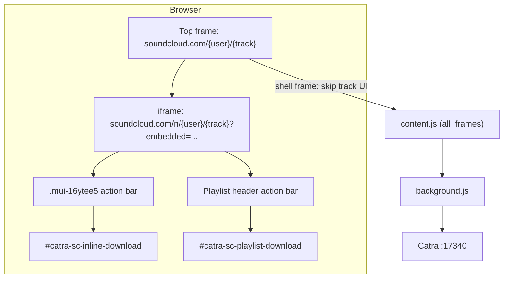

# Catra SoundCloud Chrome Extension

## Overview

Injects download buttons on SoundCloud. Track downloads POST a canonical track URL to Catra. Playlist downloads POST the playlist URL for yt-dlp playlist import.

Load unpacked from `apps/chrome/`.

## Architecture



## Injection

### Track pages and track rows

| Step | Behavior |
|------|----------|
| Frame gate | Skip top frame when it embeds an `/n/` track iframe and has no local `mui-16ytee5` |
| Container (new UI) | `.mui-16ytee5` with the most visible `MuiIconButton-root` children |
| Container (classic list) | `.playableTile__actionWrapper` |
| Position | Insert before More (`button[aria-label="More menu"]` or `.sc-button-more`) |
| URL | Strip `/n/` prefix and query params for download (`soundcloud.com/{user}/{track}`) |

### Playlist pages

| Step | Behavior |
|------|----------|
| Container | Header action bar near `h1` with 3-6 SVG action controls |
| Exclusion | Ignore rows that contain `.mui-16ytee5` or an extractable track permalink |
| Position | Append download button to the header action bar |
| URL | Canonical playlist URL (`soundcloud.com/{user}/sets/{playlist}`) |

Shared resilience: 500ms polling, `MutationObserver`, history hooks. Shadow DOM traversal via `collectElementsDeep()`.

## Files

| File | Role |
|------|------|
| `manifest.json` | `all_frames: true`, `soundcloud.com` matches |
| `src/content.js` | Frame policy, DOM injection, SPA sync |
| `src/background.js` | Catra API bridge |
| `src/utils.js` | URL normalization |
| `src/styles.css` | Button states and MUI icon sizing |

## Catra API

```http
GET  http://127.0.0.1:17340/health
POST http://127.0.0.1:17340/download
     { "url": "https://soundcloud.com/youcoree/f2f" }
POST http://127.0.0.1:17340/download/playlist
     { "url": "https://soundcloud.com/space-cadet/sets/liberex-003" }
```
