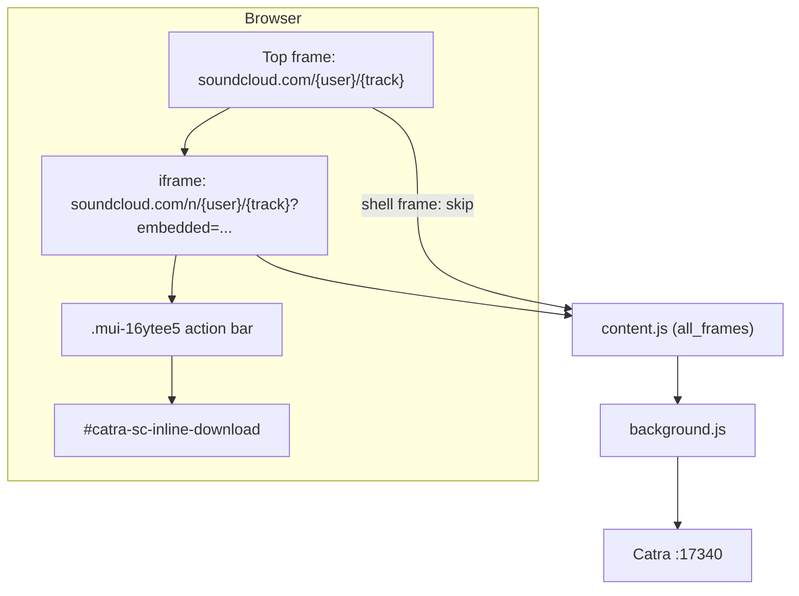

# Catra SoundCloud Chrome Extension

## Overview

Injects download buttons on SoundCloud track pages. Clicks POST the canonical track URL to the Catra desktop app (`http://127.0.0.1:17340/download`).

Load unpacked from `apps/chrome/`.

## Architecture



## SoundCloud layout

The address bar may show a classic path (`soundcloud.com/youcoree/f2f`), but the visible UI lives in a child iframe (`soundcloud.com/n/youcoree/f2f?v2_layout=true&embedded=...`). The top frame is an empty shell; injection runs in the iframe.

## Injection

| Step | Behavior |
|------|----------|
| Frame gate | Skip top frame when it embeds an `/n/` track iframe and has no local `mui-16ytee5` |
| Container | `.mui-16ytee5` with the most visible `MuiIconButton-root` children |
| Position | Insert before `button[aria-label="More menu"]` |
| URL | Strip `/n/` prefix and query params for download (`soundcloud.com/{user}/{track}`) |
| Resilience | 500ms polling, `MutationObserver` on container/button changes, history hooks |

Shadow DOM: `collectElementsDeep()` traverses shadow roots when searching for `mui-16ytee5`.

## Files

| File | Role |
|------|------|
| `manifest.json` | `all_frames: true`, `soundcloud.com` matches |
| `src/content.js` | Frame policy, DOM injection, SPA sync |
| `src/background.js` | Catra API bridge |
| `src/utils.js` | URL normalization |
| `src/styles.css` | Button states and MUI icon sizing |

## Catra API

```http
GET  http://127.0.0.1:17340/health
POST http://127.0.0.1:17340/download
     { "url": "https://soundcloud.com/youcoree/f2f" }
```
